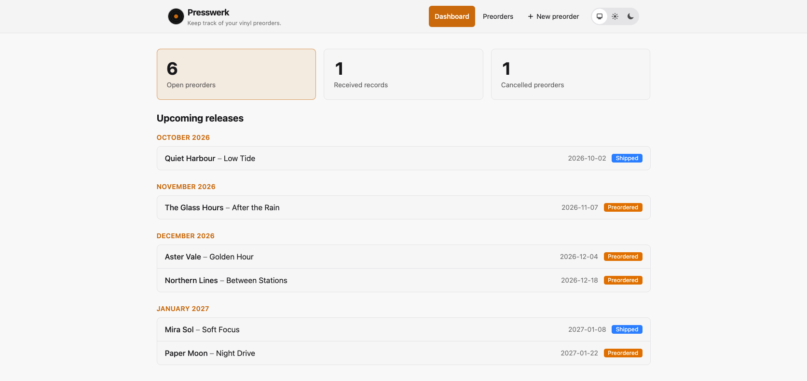
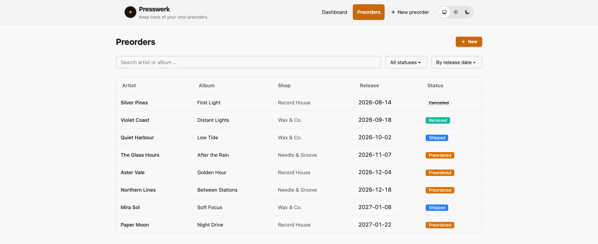
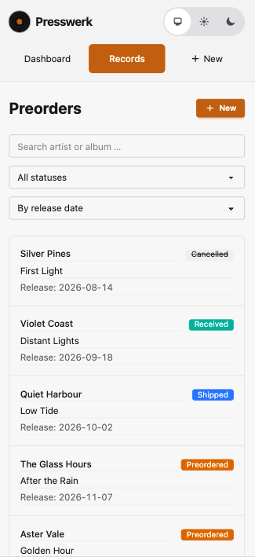

# Presswerk

**Keep track of your vinyl preorders.** Presswerk is a small, self-hosted app for one person. No login, no external services - just your records in a local SQLite database.

<p align="center">
  
</p>

## Features

- Create, edit, and delete preorders with artist, album, shop, order and release dates, links, and notes
- Track statuses: preordered, shipped, received, or cancelled
- View status counts and upcoming releases grouped by month on the dashboard
- Search by artist or album, filter by status, and sort by release date or artist

The UI supports English (default) and German. Switch languages in the footer; your choice is stored in your browser session. Built with Elixir, Phoenix LiveView, and SQLite.

## Screenshots

| Preorders on desktop | Preorders on mobile |
| :--- | :--- |
|  |  |

## Quick start

Install [mise](https://mise.jdx.dev) and Git, then run from the project directory:

```sh
mise install
mise run setup
mise run dev
```

Open <http://localhost:4000>. `mise run setup` installs dependencies, sets up the database, and builds assets.

## Run with Docker

### Docker Compose

Generate a secret once with `openssl rand -base64 48` and store it in a `.env` file next to `docker-compose.yml`:

```dotenv
SECRET_KEY_BASE=<generated secret>
```

Start the app with `docker compose up -d --build` and open <http://localhost:4000>. The SQLite database is stored in the `presswerk-data` Docker volume; migrations run when the container starts. Keep the same secret across restarts and do not commit the `.env` file. When deploying behind an HTTPS reverse proxy, set `PHX_HOST` in `.env` to the public hostname.

**Note:** Presswerk has no login. The default Docker configuration publishes port 4000, so do not expose an instance with personal data to the internet without access protection.

### Published image

The image is built on every push to `main` (`dev`) and on version tags (`latest` and `vX.Y.Z`) and published to GitHub Container Registry (GHCR) as `ghcr.io/pklink/presswerk`. Multi-arch images are available for `linux/amd64` and `linux/arm64`.

```sh
docker run -d --name presswerk \
  -p 4000:4000 \
  -e SECRET_KEY_BASE=<generated secret> \
  -e PHX_HOST=localhost \
  -v presswerk-data:/data \
  ghcr.io/pklink/presswerk:latest
```

Pull a specific release by tag, e.g. `ghcr.io/pklink/presswerk:v0.1.1`. Generate the secret with `openssl rand -base64 48`.

## Development and contributing

To run tests and checks:

```sh
mise run check
```

Bug reports and suggestions are welcome. To contribute code, fork the repository, create a branch, run the checks above, and open a pull request with a short description. Please keep the app simple and single-user, and support both UI languages.

UI strings use Gettext with English source text and German translations in `priv/gettext/de/LC_MESSAGES/`. After adding strings, run `mix gettext.extract --merge` and fill in the German translations. Changeset messages are translated through the `errors` domain when displayed; add new validation messages to `priv/gettext/errors.pot`.

To prepare a release, run `mise run release -- patch` (or `minor` / `major`) with a clean working tree. The task checks the project, commits and tags the release (e.g. `v0.1.1`), then commits the next development version (`0.1.2-dev`). It does not push; push the commits and tag when ready.

**AI disclosure:** A large part of the code in this project is AI-generated.

## License

Presswerk is licensed under the [MIT License](LICENSE).
